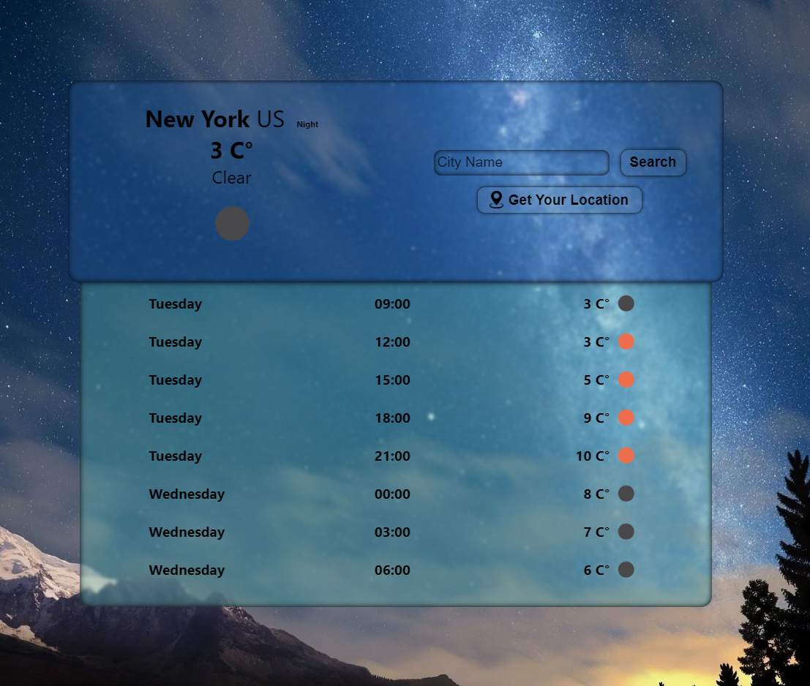

# Weather App

This app shows the current weather and the next 24 hours in 3 hour intervals. It can also show the weather information of your area using location information.


Bonus: Background changing according to the sunset and sunrise of the area

## You can view Live [Click Here](https://vkeyweatherapp.netlify.app)




# Built With
* React.JS
* Redux
* Axios
* OpenWeather API
## Install Dependencies
``` 
npm install 
```
## Run Project
```
npm start
```
## Build Project
```
npm build
```

